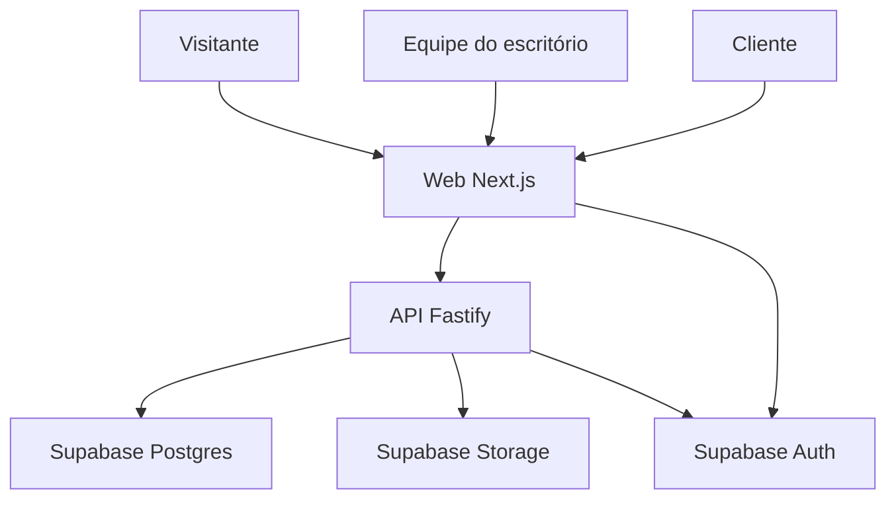

# Arquitetura técnica do SaaS jurídico

Versão 0.1 - 25/09/2026  
Estado: web e API serverless implementadas e publicadas separadamente; PostgreSQL de desenvolvimento provisionado com 29 migrations até `bind_email_sync_to_current_user`, sem dados de domínio.

## 1 Escopo e ordem

O produto terá site público, área autenticada do escritório, portal autenticado do cliente e API de domínio. A primeira entrega funcional será somente o site público, mas a estrutura reservará espaço para os demais módulos. O plano de negócio e o briefing visual são as fontes de requisitos. O nome definitivo da marca ainda será escolhido.

## 2 Stack proposta

| Camada | Escolha | Papel |
| --- | --- | --- |
| Repositório | Git, GitHub, pnpm workspaces e Turborepo | Monorepo com comandos compartilhados e deploys independentes |
| Interface | Next.js, React, TypeScript, App Router e Tailwind CSS | Site público, painel do escritório e portal do cliente com layouts separados |
| API | Node.js, TypeScript e Fastify | Regras de negócio, autorização, auditoria e operações sensíveis |
| Dados | Supabase Postgres | Banco relacional do SaaS |
| Identidade | Supabase Auth | Login, recuperação e sessões; autorização de escritório e caso continua na API |
| Arquivos | Supabase Storage com buckets privados | Documentos jurídicos com checagem de permissão e URLs temporárias |
| Esquema | Prisma, sujeito a prova de compatibilidade no bootstrap | Migrações e consultas da API |
| Validação | Zod | Contratos de entrada, saída e configuração |
| Hospedagem | Vercel para web e API, sujeita a prova de conceito | Deploys separados; validar Fastify, limites e upload antes da API real |
| Testes | Vitest e Playwright quando houver fluxos reais | Regras da API e jornadas públicas e autenticadas |

Não criar banco, autenticação ou endpoints falsos apenas para publicar a landing page. A área pública deve compilar e funcionar sozinha.

## 3 Topologia



A web usa login e cookies SSR do Supabase Auth. A API valida o Bearer token por JWKS, resolve usuário e escritório e aplica a matriz RBAC inicial; `OWNER` e `ADMIN` exigem `aal2` em operações tenant. O navegador não recebe credenciais privilegiadas do Supabase e não acessa documentos privados diretamente sem permissão verificada. A gestão de membros e convites está implementada. Handoff de propriedade e lifecycle da organização estão implementados. ACL por caso/equipe e portal do cliente permanecem futuros.

Na primeira versão, toda operação autenticada de domínio passa pela API. Consultas diretas do navegador ao Postgres não fazem parte do contrato. RLS forçada é uma camada adicional implementada e testada; complementa a autorização já aplicada pela API e não substitui a futura ACL por equipe e caso.

## 4 Estrutura planejada

```text
saas-juridico/
├── .codex/
│   ├── config.toml
│   └── agents/
├── docs/
│   ├── README.md
│   ├── fluxo-de-trabalho.md
│   ├── produto/
│   │   ├── plano-de-negocio.md
│   │   └── regras-de-negocio.md
│   ├── design/
│   │   ├── briefing-marca-ux.md
│   │   ├── decisoes.md
│   │   ├── catalogo-artes.md
│   │   └── referencias/
│   ├── tecnica/
│   │   ├── arquitetura.md
│   │   ├── decisoes/
│   │   └── contratos/
│   └── originais/
├── apps/
│   ├── web/
│   └── api/
├── packages/
│   ├── contracts/
│   └── config/
├── AGENTS.md
├── pnpm-workspace.yaml
├── turbo.json
└── package.json
```

Os diretórios `apps/`, `packages/` e os arquivos de workspace foram criados no bootstrap do monorepo.

## 5 Rotas previstas

- Públicas: `/`, `/funcionalidades`, `/como-funciona`, `/contato`, `/privacidade` e `/termos`.
- Planos: `/planos` somente após validação da proposta comercial.
- Autenticação implementada: `/login`, `/esqueci-minha-senha`, `/redefinir-senha` e `/auth/callback`; aceite de convite implementado em `/convite` e `/aceitar-convite`.
- Escritório: `/app/*`, com navegação e autorização próprias.
- Cliente: `/portal/*`, com dados expressamente liberados para sua identidade.

Uma tela pública nunca pode conter dados reais de casos ou clientes.

## 6 Domínio identidade e isolamento

- `organization_id` identifica o escritório nos registros do domínio.
- Um usuário pode ter vínculos com escritórios; permissões são avaliadas no escritório ativo.
- Caso é diferente de processo judicial: pode ser extrajudicial e ter zero ou vários processos.
- Status interno é independente do status publicado ao cliente.
- Publicar conteúdo para o cliente é uma ação explícita, autorizada e auditável.
- O cliente vê apenas conteúdo vinculado à sua identidade e liberado para o portal.
- Documentos internos permanecem privados por padrão.
- Função do usuário sozinha não basta: acesso pode depender de equipe, caso e permissão específica.
- Eventos sensíveis de acesso e mudança devem ser auditados.
- A política de retenção deve existir antes de receber dados reais.

Esses pontos derivam principalmente das regras RN 001, 004, 008, 010 a 017, 023, 024 e 027.

## 7 Uso das fontes pelos agentes

Prioridade em caso de conflito:

1. Instrução atual do usuário e decisões aprovadas.
2. `docs/tecnica/decisoes/`.
3. `docs/produto/regras-de-negocio.md`.
4. `docs/design/decisoes.md`.
5. Plano, briefing e arquitetura.
6. Código existente, desde que não contrarie as fontes anteriores.

`AGENTS.md` funciona como índice breve. Cada agente lê somente o necessário. Nenhum agente presume que arte exploratória seja layout aprovado.

## 8 Direção visual inicial

- Conceito: Jurídico Contemporâneo.
- Base: `#102A43` e `#F5F7FA`.
- Ação: `#2563EB`.
- Detalhe: `#0F8B8D`.
- Modo escuro: `#09131F`.
- Interface: DM Sans; Source Serif 4 apenas em pontos editoriais.
- Responsividade real para desktop, tablet e celular.
- Estados de foco e movimento discreto com preferência de movimento reduzido.

Nome, logo e telas permanecem sujeitos a escolha e aprovação.

## 9 Segredos e ambientes

- `.env.example` documentará apenas nomes e exemplos sem credenciais.
- `.env.local` e equivalentes ficarão fora do Git.
- Variáveis públicas conterão somente valores apropriados para o navegador.
- Chaves privilegiadas existirão apenas na API ou servidor.
- Desenvolvimento, preview e produção usarão configurações separadas.
- Migrações, backups e recuperação serão definidos antes de documentos jurídicos reais.

## 10 Marcos

| Marco | Resultado verificável |
| --- | --- |
| A Arquitetura e fontes | Documentos organizados, pendências identificadas e agentes apontando para as fontes |
| B Bootstrap | Monorepo com web e API mínimas, scripts de lint, build e typecheck, sem dados reais |
| C Site público | Páginas responsivas, acessíveis e coerentes com o briefing |
| D GitHub e Vercel | Repositório versionado, web publicada e deploy automático validado |
| E Identidade e isolamento | Supabase configurado, login e prova de separação entre escritórios |
| F Operação interna | Clientes, casos, equipe, documentos e auditoria em incrementos pequenos |
| G Portal do cliente | Conteúdo explicitamente publicado, status claro e pendências documentais |

## 11 Decisões consolidadas e abertas

A sessão usa cookies SSR do Supabase Auth na web; a API recebe Bearer token, valida JWT por JWKS, resolve o tenant no servidor e aplica RBAC antes da transação com RLS. Essa implementação está registrada em `backend-auth-clientes.md`; a defesa multi-tenant segue `decisoes/ADR-0002-isolamento-multi-tenant-postgresql.md`.

Continuam abertas:

1. Nome de trabalho e identidade final.
2. Artes que representam a direção aprovada.
3. Estratégia segura de upload e verificação de arquivos.
4. Adequação da API Fastify à hospedagem escolhida.
5. Destino, consentimento e proteção contra abuso do formulário público.

As decisões abertas serão registradas antes dos blocos correspondentes.

## Rotas públicas e SEO — 27/09/2026

A camada web inclui as rotas estáticas `/`, `/recursos`, `/seguranca`, `/planos`, `/faq`, `/contato`, `/privacidade` e `/termos`, além de 404, sitemap, robots e manifest. Esta entrega não adiciona API, persistência, autenticação ou envio de formulário.

## Fundação local da API — 27/09/2026

`apps/api` contém Fastify, Zod e Prisma com PostgreSQL, health checks e documentação OpenAPI. A modelagem multi-tenant está em `modelo-de-dados.md`. O PostgreSQL de desenvolvimento recebeu 29 migrations, incluindo convites, lifecycle, ownership, administração global e e-mail, sem dados de aplicação ou seed. O papel runtime, RLS forçada, policies e grants mínimos estão configurados. A verificação de tokens do Supabase Auth está configurada; login permanece direto na web. A API serverless está publicada em projeto Vercel separado; Storage continua não configurado; consulte `ambiente-e-supabase.md` e `migrations.md`.

## Área autenticada web — 29/09/2026

Rotas implementadas: `/login`, `/esqueci-minha-senha`, `/redefinir-senha`, `/auth/callback`, `/convite`, `/aceitar-convite`, `/app`, `/app/clientes` e `/app/equipe`. A escolha de `/login` substitui os nomes prospectivos antigos desta documentação. Sessões usam cookies SSR do Supabase; autorização e isolamento continuam na API Fastify/PostgreSQL.

## Bloco 4 — lifecycle, e-mail e SUPER_ADMIN

A administração global usa tabela e autenticação separadas de memberships tenant, AAL2 recente e projeções SQL que excluem conteúdo jurídico. Organizações suspensas ou arquivadas permanecem preservadas e somente leitura; arquivamento é terminal. O Resend é opcional e falha fechado em produção quando incompleto. A decisão está em `decisoes/ADR-0004-administracao-global-e-email.md` e os procedimentos em `bloco-4-seguranca-email-admin.md`.
