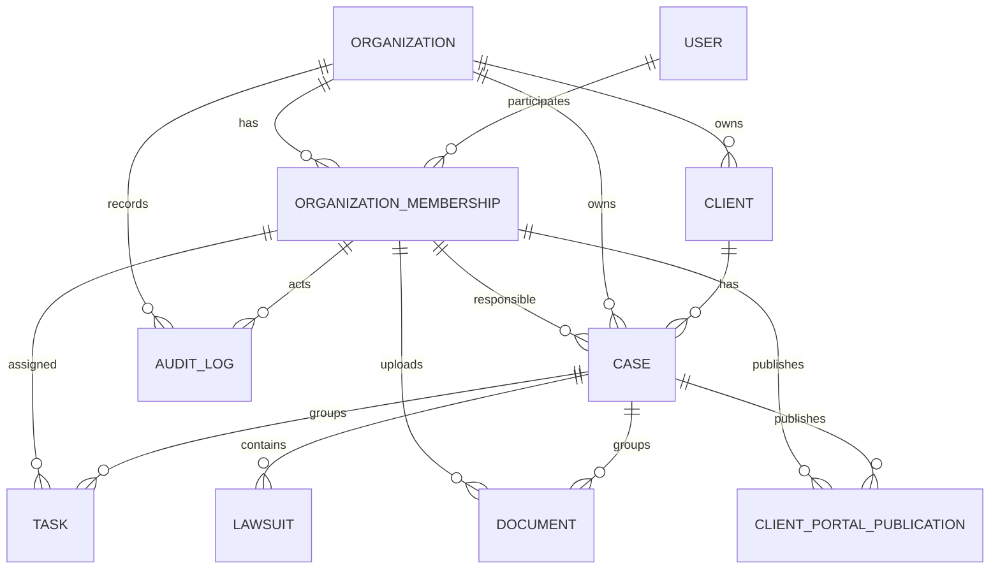

# Modelo inicial de dados

Estado: schema Prisma validado e migration `init_foundation` aplicada no banco de desenvolvimento, sem dados de aplicação ou seed.

## Estratégia

`Organization` é o limite de tenant. Toda entidade de domínio possui `organizationId`, inclusive vínculos que também poderiam inferi-lo. Consultas futuras deverão receber o tenant validado pela API; filtros do navegador não constituem isolamento. RLS será uma defesa adicional depois que identidade e policies tiverem testes de não vazamento.

## Entidades e decisões

São dez entidades: User, Organization, OrganizationMembership, Client, Case, Lawsuit, Task, Document, ClientPortalPublication e AuditLog. IDs são UUID; datas de evento usam `timestamptz`. Client, Case, Lawsuit, Task e Document têm exclusão lógica. AuditLog não possui atualização ou exclusão no modelo e deve ser imutável na aplicação.

Relações essenciais usam `Restrict` e nenhuma cascata destrutiva foi definida. As referências Client→Case, Case→Lawsuit/Task/Document/Publication usam chaves estrangeiras compostas `[organizationId, id]`, impedindo associação entre tenants. Atores de caso, tarefa, documento, publicação e auditoria referenciam `OrganizationMembership[organizationId, userId]`, portanto precisam pertencer ao mesmo escritório. Arquivos não ficam no PostgreSQL: Document guarda metadados e um caminho de Storage, único por organização, sem URL pública permanente.

Unicidades: slug da organização, identidade Auth e e-mail do usuário, membership por organização/usuário, número processual por organização e caminho de Storage por organização. Índices começam por `organizationId` nas consultas de tenant e cobrem status, responsáveis, cliente/caso, vencimento, exclusão lógica e ordem de auditoria.

Os enums são deliberadamente conservadores. Estados documentais cobrem o fluxo da RN 014 e `QUARANTINED` prepara a RN 017. Papéis apenas preparam o modelo; não implementam autorização. A coerência entre `Document.clientId` e o cliente do `Case` associado não é expressável apenas pelas relações Prisma e exigirá trigger ou regra transacional revisada. As regras “ao menos um proprietário ativo”, “ao menos um responsável por caso ativo”, limites de `readinessScore`, histórico/versionamento de publicação e imutabilidade forte de `AuditLog` também exigem constraints, triggers ou regras de domínio na migration revisada. Essas garantias não fazem parte de `init_foundation`; deverão entrar apenas em migrations ou regras de domínio futuras, com SQL e comportamento revisados antes da aplicação.

## Dados sensíveis e riscos

Documento pessoal, contato, conteúdo jurídico, metadados de arquivo, IP e user agent são sensíveis. Não existem seeds. Antes de dados reais: definir retenção, criptografia aplicável, policies RLS, Auth, autorização por caso, trilha de versões, Storage privado, varredura de uploads e testes entre tenants.
